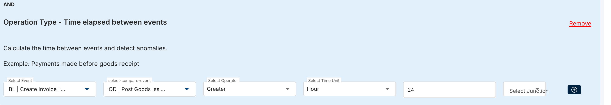

# Dohler O2C Rules
ZRED_T_P2P_DET — rule detail raporu —> Rule ID’yi ZRED01 işlem kodundan bulmalısın.

* ==**DOH-001**==
  * RULE: O2C_DOH_001_D011
  * DOCUMENT TYPE = COMMISSION THEN LOW RISK (ZCOM) ✅
  * ANOTHER TYPE  THEN HIGH RISK ✅
  * FIORI REPORT —> COMPANY CODE, USER AND AMOUNT IN RF CURRENCY ✅ 
  * YEAR OF CREATION OF THE DOCUMENT ✅
* ==**DOH-002** ✅==
  * RULE: O2C_DOH_002_D011
  * DOCUMENT TYPE = ZMUN THEN LOW RISK
  * ANOTHER TYPE  THEN HIGH RISK
* ==**DOH-003** ✅==
  * KEEP IT
* ==**DOH-004** ✅==
  * KEEP IT
* ==**DOH-005** (O2C_DOH_005_01_D060) ✅==
  * IF IT’S THE SAME DAY — NOTHING
  * OTHERWISE - HIGH RISK
    
    Billing > GI + 24H
* **DOH-006** O2C_DOH_006_01_D011
  * IF IT’S CRONACLE — LOW RISK - OTHERWISE - HIGH RISK —> There will be two risk LOW & HIGH ✅
  * ADD ORDER VALUE ✅
  * ADD CUSTOMER ✅
* ==**DOH-007** ✅==
  * KEEP IT
	